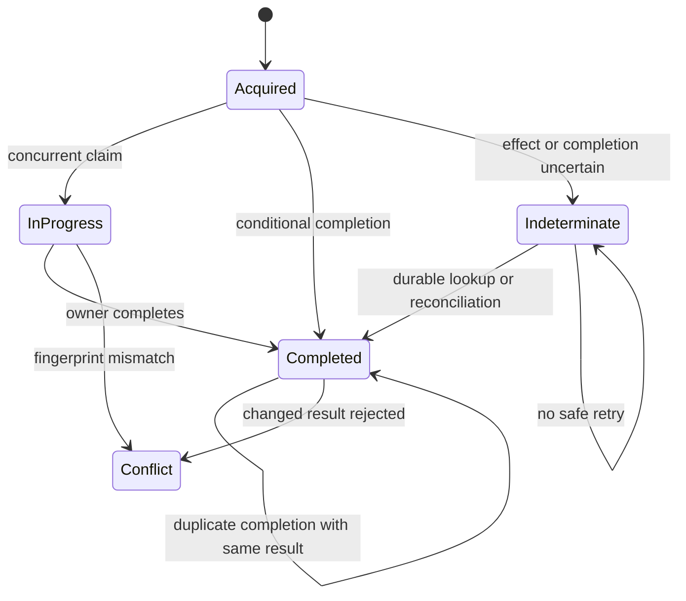
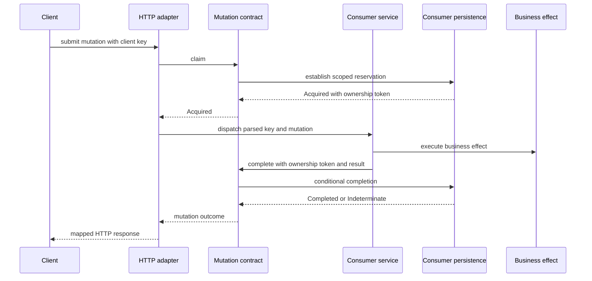

# Shared mutation and HTTP integration design

## Status and scope

This design specifies future capabilities; it does not describe implemented
APIs. The roadmap phases 3 and 4 deliver these capabilities. Existing key,
payload-hash, response-snapshot, pagination, and Server-Sent Events (SSE)
helpers remain supported until an explicit migration is published.

[ADR 002](adr-002-scoped-mutation-contracts.md) accepts the shared behavioural
boundary. [ADR 003](adr-003-mutation-recovery-and-replay.md) records proposed
recovery and replay choices. [ADR 004](adr-004-shared-http-integration.md)
records proposed HTTP integration and extraction decisions.

The library owns reusable operation identity, state-transition contracts,
transport helpers, and conformance tests. Consumers own authorization,
transactions, durable storage, business effects, retention, and recovery. No
library helper can confer atomicity on independent writes.

## Evidence and existing surface

The source review used actix-v2a `c8f68e8`, Wildside `ed897e07`, and Corbusier
`19e1daf`. These observations identify integration requirements rather than
runtime reproductions of defects.[^1][^2][^3]

- The existing `src/idempotency/record.rs` has a key, mutation discriminator,
  payload hash, and HTTP response snapshot. It has no principal or target
  scope, reservation ownership, or uncertain-outcome state.
- Wildside annotations execute a mutation before inserting its deduplication
  record. Competing requests can reach the mutation before the unique insert.
- Wildside offline bundles reserve first, execute, then update a snapshot.
  A crash between the effect and completion leaves an unresolved reservation.
- Corbusier task handlers validate the idempotency header but discard its key.
  Header validation alone supplies no request deduplication.
- Corbusier hooks reserve by tenant, trigger context, and hook before actions.
  This proves a non-HTTP use case for reservation and completion vocabulary.

The repository sweep found existing key parsing, canonical JSON hashing, lookup
classification, HTTP error adaptation, pagination, and SSE helpers. The
extension must compose these features rather than introduce parallel
implementations. A consumer's local counterpart is an extraction candidate, not
evidence that its current algorithm is safe to copy unchanged.

## Ownership and reuse

Core mutation types belong with `src/idempotency/`; HTTP extraction stays in
its HTTP adapter. Error and pagination extensions stay with their existing
features. No domain type may depend on Actix request objects. A separately
consumable conformance harness must be usable by downstream adapter tests; its
packaging is resolved in task 3.2.1.

Application services may compose the core types with domain ports. HTTP
handlers may use extractors and response adapters. Persistence adapters must
implement the agreed behavioural guarantees without exposing SQL, RouchDB,
revision tokens, or connection pools in the shared interface. The library must
not install global telemetry subscribers or metric recorders.

## Scoped operation identity

Operation identity consists of application-defined scope, operation, target,
and client key. Scope includes authenticated tenant and principal where those
boundaries exist. Target may identify a collection for creation or a resource
for update. Applications derive scope from trusted context, not arbitrary
client-supplied tenant fields.

The payload fingerprint is associated data, never part of the uniqueness key.
Two different payloads for the same identity conflict rather than create two
operations. Scope components need unambiguous, versioned encoding; delimiter
concatenation is insufficient. Concrete wrappers and generic parameters remain
open under ADR 003.

Fingerprinting operates on validated, normalized request intent, before adding
server-generated identifiers or timestamps. Each record stores the fingerprint
profile version. Profile changes must not silently bypass old records. Secret
handling is explicit: exclude generated credentials, but do not discard an
input field whose value changes the operation's meaning. Sensitive request
fingerprints need a documented storage and threat model.

Keep the current UUID key contract initially. Required and optional header
extractors must be distinct, reject duplicate or malformed headers, and retain
the parsed key through application dispatch. Broadening accepted key syntax
requires a separate compatibility decision.

## Reservation and completion semantics

Names below describe required outcomes, not a finalized Rust API.

- `Acquired` grants one owner permission to attempt the operation and returns
  an opaque ownership token or generation.
- `InProgress` denotes an existing reservation with the same fingerprint.
- `Completed` exposes an application-defined durable result or reference.
- `Conflict` denotes the same identity with a different fingerprint.
- `Indeterminate` denotes an outcome that cannot safely be inferred after
  failure, cancellation, or restart.

The following diagram shows the permitted transitions between these outcomes.
No transition returns an indeterminate operation to a claimable state, so
recovery is always a form of reading durable state or reconciliation.

For screen readers: The following state diagram traces the mutation outcome
state machine from the initial `Acquired` reservation through `InProgress`,
`Completed`, `Conflict`, and `Indeterminate`, including duplicate completion
with the same result and rejection of a changed result.

_Figure 1: Mutation outcome transitions from reservation through completion,
conflict, or indeterminate reconciliation._

Claim must atomically establish uniqueness and compare an existing record's
fingerprint. Scope mismatch cannot return another principal's result.
Completion must conditionally match both operation identity and current
ownership. Repeating completion with the same result is harmless; changing a
completed result through that operation is rejected. Read-only lookup does not
authorize execution.

A known terminal failure may be retained as a result under consumer policy. A
transport error, timeout, or failed completion write is not proof that the
business effect did not occur. Consumers must be able to resolve an uncertain
write by reading durable state without automatically rerunning the mutation.

## Atomicity and recovery

Support two integration patterns, with explicit evidence for each adapter:

1. Commit the domain mutation and deduplication result in the same durable
   transaction or atomic aggregate. A failed commit leaves neither visible; an
   ambiguous acknowledgement is resolved by lookup.
2. Reserve separately before a non-transactional effect. Persist completion
   separately, expose unresolved execution, and reconcile using a durable
   effect identifier or a downstream idempotency facility.

The sequence below shows the second pattern: a request claims a scoped
reservation before the consumer executes the effect, and completion is
conditional on the ownership token returned by the claim. Failure between the
effect and the completion write is what leaves an operation indeterminate
rather than safely retryable.

For screen readers: The following sequence diagram shows a client submitting a
mutation with a client key, the HTTP adapter claiming a scoped reservation
through the shared contract, the consumer service executing the business effect
and completing conditionally on its ownership token, and the adapter mapping
the resulting outcome to an HTTP response. The consumer's persistence records
the reservation and the completion; the shared contract does not own storage.

_Figure 2: Claim, effect, and conditional completion across the shared contract
and consumer-owned persistence._

An outbox can durably schedule an external effect alongside a domain write; its
delivery still needs duplicate handling. No helper promises exactly-once
external execution. Database transaction handles, outbox implementations, and
consumer-specific reconciliation remain outside actix-v2a.

Lease expiry is not permission to repeat an uncertain effect. Automatic
reclamation is disabled unless a consumer proves that the previous attempt
cannot still act, or the effect destination enforces a fencing token or stable
idempotency identity. Rejecting stale completion alone cannot fence the effect.

Time and waiting are injected. Waiting has a finite budget and cancellation
behaviour. Durable expiry uses a documented clock policy; local waiting uses
elapsed time. Retention is consumer-owned and separate from lease duration.
Deleting a record reopens its identity, so permanent creation deduplication may
need a durable marker after any response cache expires. Cleanup must not erase
unresolved work merely because its response-retention period elapsed.

## Replay and authorization

Results may be typed values, resource references, or explicitly selected HTTP
snapshots. Authorization runs before claim and before replay. A stored success
is not an authorization grant. Reconstructing a resource response must respect
current redaction, deletion, and access policy.

Mornington should retain post references rather than stale post bodies where
redaction matters. One-time subordinate credentials require a separately
specified recovery policy; plaintext secrets must not become generic replay
snapshots. Wildside and Corbusier may retain suitable snapshots, but must
define which response fields and headers are safe to persist.

## HTTP integration and other extractions

The shared HTTP layer maps typed outcomes to documented responses, including
retry guidance where appropriate. Status codes, reason identifiers, retry
headers, and compatibility with each consumer's existing envelope are resolved
in ADR 004 before implementation. Unknown outcomes must remain distinguishable
from requests that are known not to have executed.

The following bounded extensions reuse the existing error and pagination
surfaces rather than changing application policy:

- Structured validation details: field path, optional array index, and stable
  reason identifier. Raw submitted values are excluded by default.
- Public error conversion: preserve explicit status, safe details, and trace
  context without repeating status-to-code mapping in each consumer.
- Correlation helpers: validate length and syntax, read or create once per
  request, and propagate consistently. Correlation identifiers are distinct
  from distributed tracing identifiers and never establish identity.
- Pagination errors: compose existing cursor and direction errors with the
  shared HTTP envelope. Base64 cursor encoding is not authentication or
  encryption; protected cursors remain a separate future requirement.
- Mutation telemetry: bounded operation categories and outcomes, plus timing
  and age buckets where useful. Exclude keys, principals, resource identifiers,
  payloads, and hashed user identifiers from metric labels.

Wildside's field/index validation and outcome metrics, and Corbusier's error
conversion and request-correlation helpers, supply extraction examples. Their
application-specific messages, Prometheus registration, authentication, and
tenant policy remain local. Existing SSE framing is already shared and needs no
new extraction in this workstream.

## Conformance and acceptance

The shared harness must verify observable outcomes, not matching backend
revision hashes or SQL layouts. It must support isolated fixtures, an injected
clock, and fault points controlled by the adapter harness.

Required scenarios cover scope isolation, simultaneous claims, mismatched
fingerprints, duplicate completion, stale owners, cancellation, restart after
claim, effect-before-completion failure, ambiguous commit acknowledgement,
retention boundaries, and fingerprint-profile upgrades. Model or property tests
exercise transition orderings; deterministic concurrency tests coordinate
contenders rather than relying on sleeps.

Adapters must declare whether they support atomic domain/result commit or
separate reservation. Tests must not award an atomicity guarantee to the
latter. Consumer suites additionally prove current authorization on replay,
redaction, secret handling, and externally visible HTTP behaviour.

Wildside adoption should replace its competing mutation algorithms with the
agreed contract while retaining application transactions. Corbusier adoption
must carry the parsed task key into deduplication and apply the state model to
hook reservations without forcing hooks through an HTTP response snapshot.
Mornington must run the same applicable contracts against memory and durable
RouchDB modes before claiming production persistence guarantees.

## Delivery and compatibility

Roadmap phase 3 delivers mutation contracts and a downstream test harness.
Phase 4 delivers supporting HTTP helpers and migration documentation. Existing
public constructors and serialized records need an explicit compatibility plan;
adding scope cannot silently reinterpret old global records. Prefer additive
APIs, then a documented deprecation or versioned transition if required.

Downstream adoption issues must name prerequisite task IDs and a released
version or reviewed Git revision containing their implementation. Merging this
design is not sufficient to unblock adoption. Existing completed execution
plans remain historical and must not be rewritten to claim the new work landed.

[^1]: [Existing actix-v2a records](https://github.com/leynos/actix-v2a/blob/c8f68e8/src/idempotency/record.rs).

[^2]: Wildside
      [annotation mutations](https://github.com/leynos/wildside/blob/ed897e07/backend/src/domain/annotations/service.rs)
    and [bundle reservations](https://github.com/leynos/wildside/blob/ed897e07/backend/src/domain/offline_bundle_service_idempotency.rs).

[^3]: Corbusier
      [task extraction](https://github.com/leynos/corbusier/blob/19e1daf/src/http_api/routes/tasks.rs)
    and [hook reservations](https://github.com/leynos/corbusier/blob/19e1daf/src/hook_engine/ports/execution_log.rs).
